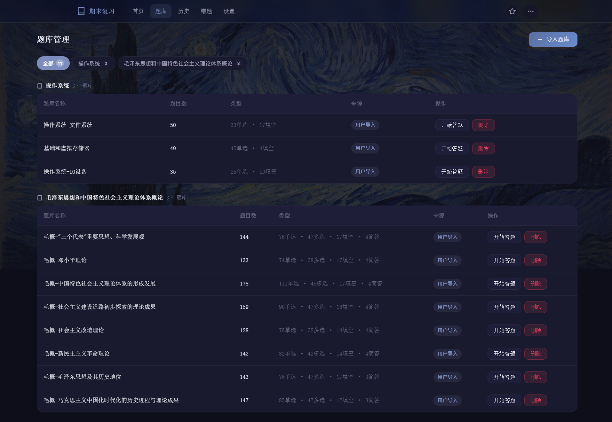
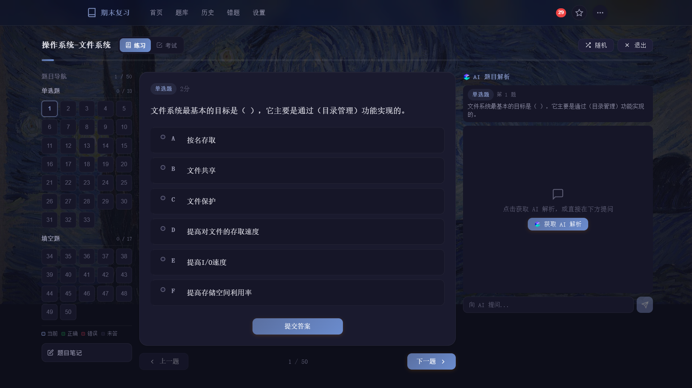
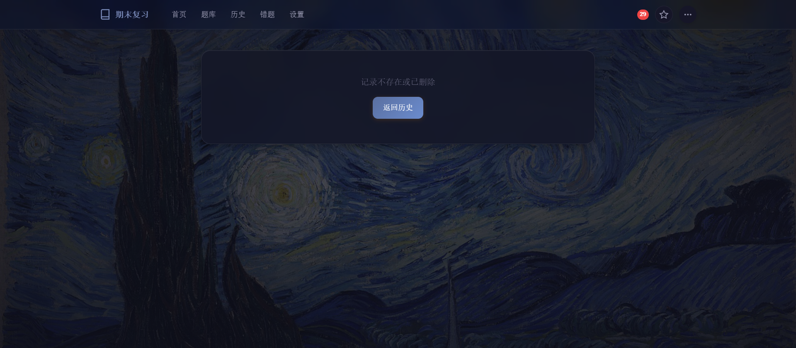
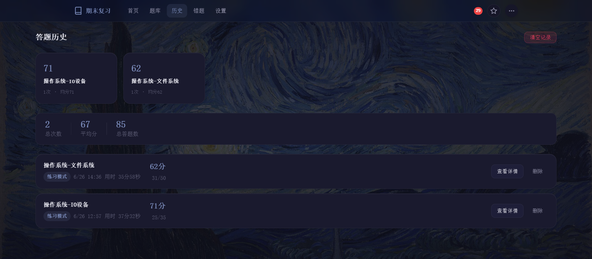
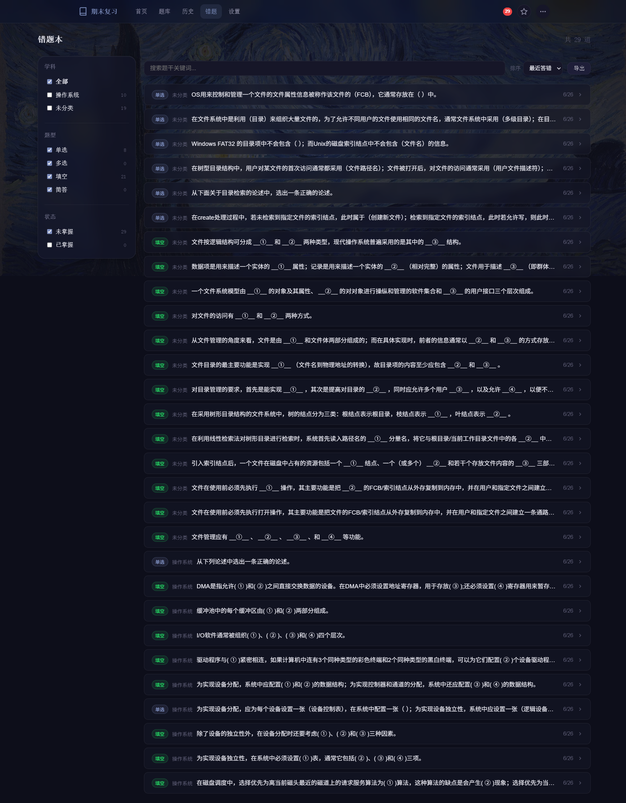
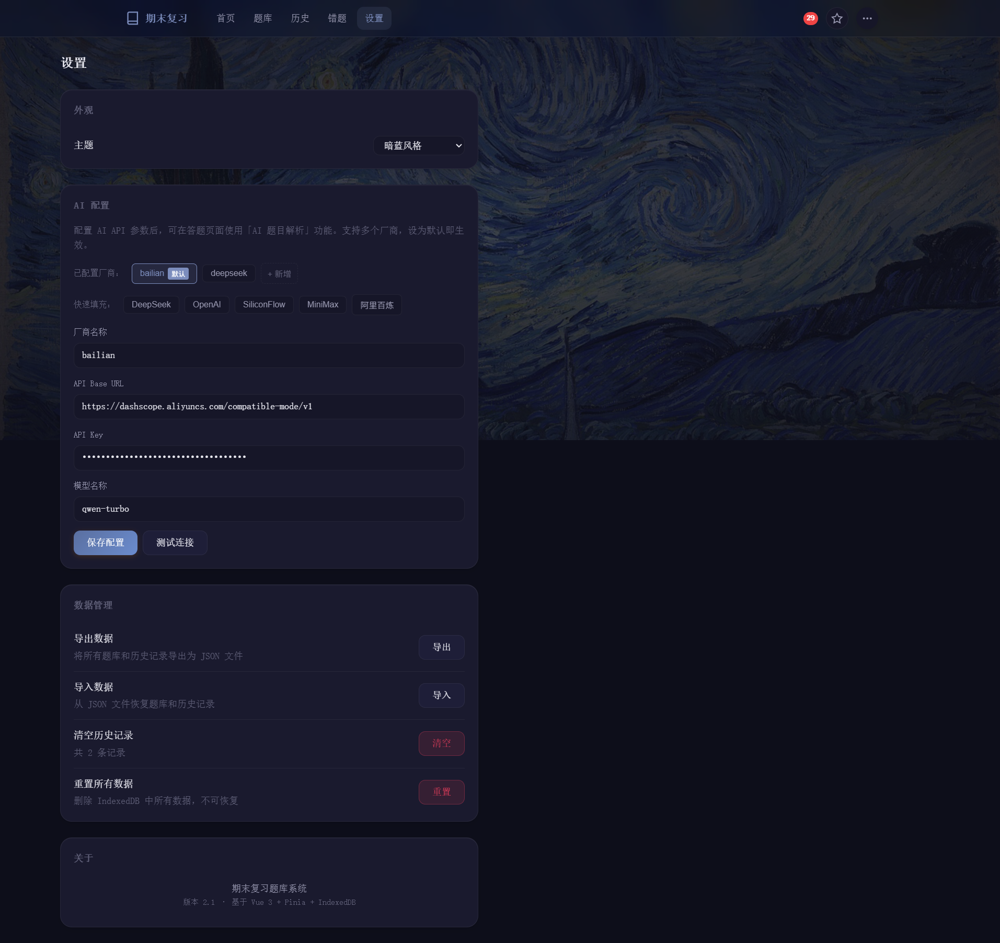

# FinalPrep - 期末复习题库系统

<div align="center">

[](https://github.com/shy20057/finalPreview/releases)
[](https://github.com/shy20057/finalPreview/releases)
[](https://vuejs.org/)
[](LICENSE)

</div>

FinalPrep 是一个基于 Vue 3 + Express.js 构建的在线练习与考试系统，支持单选题、多选题、填空题等多种题型，提供练习模式和考试模式，帮助学生高效完成期末复习。


---

## 功能特性

### 核心功能

| 功能 | 说明 |
|------|------|
| 题库管理 | 内置题库与自定义题库导入，支持 Markdown 格式题库文件 |
| 练习模式 | 随机出题、实时判分、错题自动收录 |
| 考试模式 | 固定顺序、锁定答案、模拟真实考试环境 |
| 错题本 | 智能收集错题、针对性训练、掌握度追踪 |
| 历史记录 | 完整答题记录、按题库分类统计、正确率趋势分析 |
| 笔记系统 | 层级文件夹结构、Markdown 富文本编辑 |

### 支持题型

- **单选题** - 单项选择，四个选项
- **多选题** - 多项选择，可能有多个正确答案
- **填空题** - 填写空白处答案
- **简答题** - 开放性问答

---

## 界面预览

### 题库管理



按科目分类展示题库，显示题目数量和类型分布，支持导入和删除操作。

### 答题界面



清晰的题目展示，直观的答题进度指示，支持多种题型作答。

### 答题结果



分数统计与正确率展示，正确答案对比分析，错题自动收录至错题本。

### 历史记录



完整的答题历史记录，按题库分类统计各项数据。

### 错题本



自动收集练习过程中的错题，支持针对训练和掌握度追踪。

### 笔记系统


层级文件夹结构，支持 Markdown 富文本编辑，方便整理学习笔记。

### 设置



支持亮色/暗色主题切换，满足个性化需求。

---

## 技术架构

```
┌─────────────────────────────────────────────────────────┐
│                        Frontend                          │
│           Vue 3 + Pinia + Vue Router + Vite             │
└─────────────────────────────────────────────────────────┘
                              │
                              ▼
┌─────────────────────────────────────────────────────────┐
│                         Backend                          │
│            Express.js + SQLite (node:sqlite)            │
└─────────────────────────────────────────────────────────┘
```

### 技术栈

**Frontend**

| 技术 | 用途 |
|------|------|
| Vue 3 | 渐进式 JavaScript 框架 |
| Pinia | 状态管理 |
| Vue Router | 单页应用路由 |
| Vite | 构建工具 |

**Backend**

| 技术 | 用途 |
|------|------|
| Express.js | Web 框架 |
| SQLite | 轻量级数据库（Node.js 内置 node:sqlite） |

### 项目结构

```
FinalPrep/
├── public/                    # 静态资源
│   ├── banks/                 # 内置题库文件
│   ├── assets/images/         # 图片资源
│   └── resources/             # 学习资料
├── server/                    # 后端服务
│   ├── data/                  # SQLite 数据库
│   └── server.js              # Express 服务入口
├── src/                       # 前端源代码
│   ├── components/            # Vue 组件
│   │   ├── notes/             # 笔记相关组件
│   │   └── wrongbook/         # 错题本组件
│   ├── stores/                # Pinia 状态管理
│   ├── views/                 # 页面视图
│   ├── utils/                 # 工具函数
│   └── router/                # 路由配置
├── screenshots/               # 界面截图
└── vite.config.js             # Vite 配置
```

---

## 快速开始

### 环境要求

- Node.js >= 16
- npm >= 8

### 安装

```bash
# 克隆项目
git clone https://github.com/shy20057/finalPreview.git
cd finalPreview

# 安装前端依赖
npm install

# 安装后端依赖
cd server && npm install
```

### 运行

```bash
# 启动前端开发服务器
npm run dev
# 访问 http://localhost:5173

# 启动后端服务（另起终端）
cd server && node server.js
# API 服务运行在 http://localhost:3000
```

### 构建

```bash
# 构建生产版本
npm run build

# 预览生产版本
npm run preview
```

---

## 题库格式

题库采用 Markdown 格式存储，JSON 代码块包含题目数据：

```markdown
# 题库名称

```json
{
  "bank": {
    "id": "bank-id",
    "name": "题库名称",
    "description": "题库描述"
  },
  "questions": [
    {
      "id": 1,
      "type": "single",
      "question": "单选题题目内容",
      "options": [
        { "label": "A", "text": "选项A" },
        { "label": "B", "text": "选项B" },
        { "label": "C", "text": "选项C" },
        { "label": "D", "text": "选项D" }
      ],
      "answer": "A",
      "score": 2
    },
    {
      "id": 2,
      "type": "multi",
      "question": "多选题题目内容",
      "options": [
        { "label": "A", "text": "选项A" },
        { "label": "B", "text": "选项B" },
        { "label": "C", "text": "选项C" },
        { "label": "D", "text": "选项D" }
      ],
      "answer": ["A", "C"],
      "score": 2
    },
    {
      "id": 3,
      "type": "fill",
      "question": "填空题：世界上最高的山峰是(__①__)",
      "blanks": 1,
      "answer": ["珠穆朗玛峰"],
      "score": 2
    }
  ]
}
```
```

---

## API 接口

| 方法 | 路径 | 说明 |
|------|------|------|
| GET | /api/banks | 获取题库列表 |
| POST | /api/banks | 导入新题库 |
| GET | /api/history | 获取历史记录 |
| POST | /api/history | 保存答题记录 |
| DELETE | /api/history/:id | 删除历史记录 |
| GET | /api/notes | 获取笔记列表 |
| POST | /api/notes | 创建笔记/文件夹 |
| PUT | /api/notes/:id | 更新笔记 |
| DELETE | /api/notes/:id | 删除笔记 |

---

## 设计特点

- **护眼配色** - 采用翡翠绿（#059669）为主色调，温和不伤眼
- **暗色模式** - 支持深色主题，减少视觉疲劳
- **流畅动画** - 使用 cubic-bezier 缓动曲线，丝滑体验
- **骨架屏** - 加载时显示骨架动画，优化体验
- **响应式布局** - 适配桌面和移动设备

---

## 许可证

MIT License